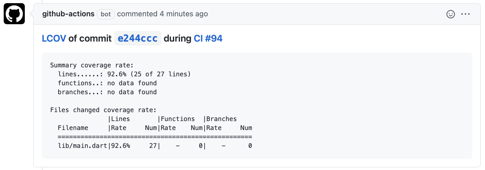

# GitHub Action — Report LCOV

This GitHub Action (written in JavaScript) allows you to leverage GitHub Actions to report the code coverage from LCOV files. This action includes:
- Generating an HTML report as an artifact
- Commenting on a pull request (if the workflow was triggered by this event)
- Failing if a minimum coverage is not met

## Usage
### Pre-requisites
Create a workflow `.yml` file in your `.github/workflows` directory. An [example workflow](#common-workflow) is available below. For more information, reference the GitHub Help Documentation for [Creating a workflow file](https://help.github.com/en/articles/configuring-a-workflow#creating-a-workflow-file).

### Inputs
For more information on these inputs, see the [Workflow syntax for GitHub Actions](https://docs.github.com/actions/reference/workflow-syntax-for-github-actions#jobsjob_idstepswith)

- `coverage-files`: The coverage files to scan. For example, `coverage/lcov.*.info`
- `artifact-name`: The GitHub artifact name of the generated HTML report. For example, `code-coverage-report`. _Note:_ When downloading, it will be extracted in an `html` directory
- `minimum-coverage`: The minimum coverage to pass the check. Optional. Default: `0` (always passes)
- `github-token`: Set the `${{ secrets.GITHUB_TOKEN }}` token to have the action comment the coverage summary in the pull request. This token is provided by Actions, you do not need to create your own token. Optional. Default: ``
- `project-dir`: [Optional] The custom directory. Use only if your project folder is not in the root folder (e.g. in case your repo contains multiple projects)

### Outputs
None.

Sample comment:


### Common workflow

```yaml
on: pull_request

name: Continuous Integration

jobs:
  coverage_report:
    name: Generate coverage report
    needs: testing
    runs-on: ubuntu-latest
    steps:
    - name: Checkout code
      uses: actions/checkout@v2
    # ... Generate LCOV files or download it from a different job
    - name: Report code coverage
      uses: zgosalvez/github-actions-report-lcov@v1
      with:
        # Optional: use only if your project not located on root.
        # project-dir: apps/my-first-app
        coverage-files: coverage/lcov.*.info
        minimum-coverage: 90
        artifact-name: code-coverage-report
        github-token: ${{ secrets.GITHUB_TOKEN }}
```

### Flutter Workflows

This is used in my opinionated [GitHub Actions: Flutter Workflows](https://github.com/zgosalvez/github-actions-flutter-workflows) repository along with other actions for a complete end-to-end DevOps experience.

## License
The scripts and documentation in this project are released under the [MIT License](LICENSE)